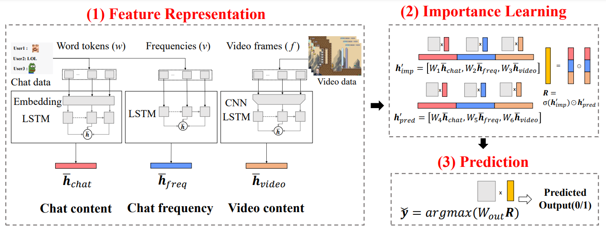
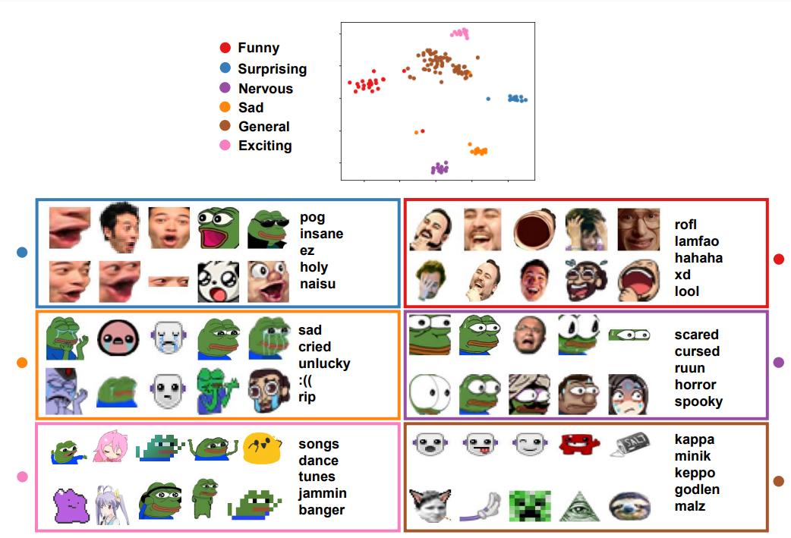

# Finding-Epic-Moments-in-Live-Content-throughLearning-from-Collective-Decisions

This repository is the PyTorch codes for "Finding-Epic-Moments-in-Live-Content-throughLearning-from-Collective-Decisions", which is submitted to EPJ-DataScience.

## Highlight ##
* We model the audience sentiment by employing an embedding approach representing the meanings of emoting expressions in a fixed-dimensional vector space.
* We present a deep learning model that detects enjoyable moments by classifying popular and ordinary moments. Experiments confirm that the model can detect popular clips with an accuracy of 0.8261 and that the combined usage of multimodal features (i.e., chat and video content) is critical.
* We conduct a user study to evaluate our algorithm-based suggestions against the human-expert edited epic moments. The crowdsourced experiment reveals the potential that the algorithmic suggestions are comparable to human decisions. Furthermore, algorithmic suggestions cover diverse emotions, such asfunny, sad, exciting, and nervous, as intended.

## MINT model architecture ##
 

## Emote Embedding  ##
Emote embedding training code(twitch_emote_embedding_train.py) and its usage covered in readme.txt.

##### Example of Emote embedding #####
 
## Pretrained Embedding Model ##
We provide pretrained embedding models with top 1000 vectors as follows: `twitch_emote_embedding_all_top1000.kvmodel`, `twitch_emote_embedding_male_top1000.kvmodel`
To access them please use following codes.
```
from gensim.models import KeyedVectors
kv_full = KeyedVectors.load('twitch_emote_embedding_all_top1000.kvmodel') # trained by full dataset
kv_maleonly = KeyedVectors.load('twitch_emote_embedding_male_top1000.kvmodel') # trained by male streamers only
```
## Metadatas ##
Due to the huge size of the dataset, we provide clip and video identifier(ids) used in the experiments. `video_ids.csv`, `clip_ids.csv`

## Contact ##
Due to the terms of uses and its large sizes, the full embedding models and dataset are available on demand (contact: hyun78.song@gmail.com)


